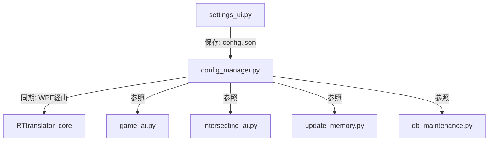

# LM Studio / Ollama マルチプロバイダ統合システム開発メモ

本ドキュメントは、SecreAI v1.3.1 に導入されたローカル LLM マルチプロバイダ（Ollama および LM Studio）の連携機能に関する設計思想、UIの共存ルール、および実装上の注意点を記録した開発メモです。今後の他プロジェクトや機能拡張への転用を想定しています。

---

## 1. 設計思想と共存ルール

### ① URL入力欄の常時共存
- **背景**: ユーザーが Ollama と LM Studio を都度切り替えて使用する可能性を考慮。
- **ルール**: 設定 UI（`settings_ui.py`）において、現在選択されているプロバイダに関わらず、**Ollama URL と LM Studio URL の両方の入力欄を常時表示**します。
- **利点**: プロバイダのラジオボタンを切り替えるだけで、過去に入力したURLを失うことなくスムーズにローカルAI接続先を切り替えられます。

### ② エンドポイントとリクエストの出し分け
- **Ollama**:
  - モデルリスト取得: `/api/tags`
  - チャット API: `/api/chat`（`options` パラメータで `num_ctx` や `temperature` を設定）
- **LM Studio**:
  - モデルリスト取得: `/v1/models`
  - チャット API: `/v1/chat/completions`（OpenAI互換。`temperature` などのパラメータはトップレベルに配置し、Ollama専用の `options` は除外する）

---

## 2. システム各層での実装内容

### ① メインハブ UI (Python Tkinter / C# WPF)
- **settings_ui.py**:
  - ラジオボタンにより `LOCAL_LLM_PROVIDER` ("ollama" / "lmstudio") を切り替え。
  - 「モデルリストを取得」ボタン押下時、選択中のプロバイダに応じて動的に API エンドポイントを切り替えて取得を実行。キャッシュデータも `CACHED_LMSTUDIO_MODELS` を新設して分離。
  - 設定保存時、Ollama/LM Studio 双方の URL 状態を保持。
- **SecreAI_Hub_Window.cs (WPF)**:
  - 翻訳字幕エンジン（RTT）の起動および設定保存時に、`LOCAL_LLM_PROVIDER` の設定を参照し、それに対応する接続 URL（`OLLAMA_URL` または `LMSTUDIO_URL`）を RTT 用の設定ファイル `config.json` の `ollama_url` キーへと自動でマッピングして伝播させます。

### ② バックエンド AI コア (Python)
- **game_ai.py**:
  - `local_llm_chat` 共通関数を実装。Ollama クライアントのインスタンス生成によるポート対応、および LM Studio 用の `/v1/chat/completions` 分岐リクエスト処理を一元化。
  - 検索ゲートキーパー `should_execute_search`、Web検索要約、ChromaDB保存時の要約処理をこの共通関数へ移行。
  - 通常のローカルチャット部でもペイロードパラメータをプロバイダに合わせて最適化。
  - Google Grounding の制限リセットを日単位から「月単位（`GROUNDING_MONTH`）」に変更。
- **intersecting_ai.py**:
  - 三位一体検索（総督）の集約処理において、LM Studio の非同期 OpenAI 互換 API 接続に対応（`AsyncOpenAI` クライアントを使用）。
- **update_memory.py / db_maintenance.py**:
  - メモリデータベース要約、キーワード生成、およびデータベースメンテナンス実行時に、Ollama 固有の `options` パラメータを排除した LM Studio 向け OpenAI 互換リクエスト構造に対応。

### ③ 翻訳コア（RTtranslator）
- **translator.py / main.py**:
  - `local_llm_provider` 引数を追加。
  - キューの翻訳処理実行時、プロバイダが `lmstudio` であれば `/v1/chat/completions` を叩き、前置き除去のための再試行処理（温度パラメータ `temperature` の変更）も OpenAI 互換ペイロードに対して実行。
  - 接続テスト（`test_connection`）およびモデルリスト取得（`get_available_models`）もプロバイダに応じて動作を自動的に出し分け。

---

## 3. ポート 11435 に関する特記事項
- ユーザーの環境において、LM Studio はポート **`11435`** で待機するよう構成されています。
- これに対応するため、システム内のデフォルト設定における `LMSTUDIO_URL` を **`http://localhost:11435/v1`** に更新しています。

## 4. テストとデバッグ手順
- **Ollama 接続テスト**:
  - Ollama を起動し、設定画面で `Ollama` を選択した状態で「モデルリストを取得」を押下し、モデル一覧がロードされることを確認。
- **LM Studio 接続テスト**:
  - LM Studio をポート `11435` で起動し（OpenAI 互換サーバーモード）、設定画面で `LM Studio` を選択して「モデルリストを取得」を押下し、モデル一覧がロードされることを確認。
- **翻訳テスト**:
  - RTトランスレーターを起動し、テキストが指定言語へ正しく翻訳され、前置き（「翻訳結果は〜」等）が混入しないことを確認。
