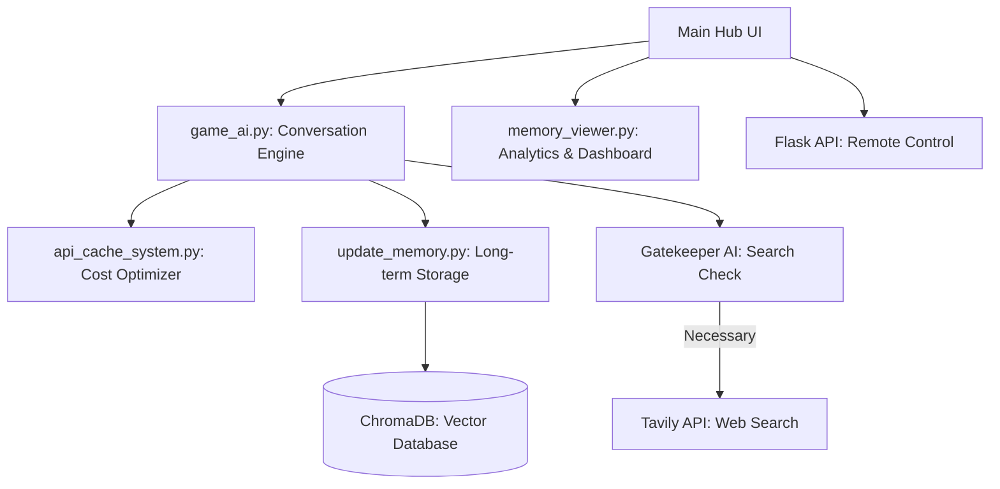

# SecreAI - 高性能AI秘書システム (Ver 1.0.0)

SecreAIは、Google Geminiをコアエンジンに据え、ウェブ検索、画像認識、長期記憶、音声合成を統合した次世代のAIアシスタントです。ゲーム中や作業中に邪魔にならないオーバーレイUIを備え、あなたの「相棒」として成長していきます。

---

## 🚀 主要機能 (Ver 1.0.0 正式版)

- **マルチモーダル対話**: テキスト、音声、視覚（画面キャプチャ）を組み合わせた自然な対話。
- **ゲートキーパーAI**: ウェブ検索の必要性を事前に判断し、APIコストを削減しながら最速の回答を提供。
- **多層記憶システム**: 短期・中期・長期の3段階で記憶を管理。会話を重ねるごとにユーザーの好みを学習。
- **パフォーマンスダッシュボード**: 各AIモデル（Gemini, OpenAI, Ollama等）の使用状況をリアルタイムで可視化。
- **インテリジェント最適化**: 徹底したキャッシュ（API/検索）とバックグラウンド並列処理による低レイテンシ体験。

---

## 🏗 アーキテクチャ概要

SecreAIは、ハブ（GUI）を中心に、独立したスクリプト群が協調して動作するマイクロサービス的な構成をとっています。

---

## � AIモデルの特徴とコストについて (2026年2月現在)

初めて利用される方向けに、各AIモデルの性能と気になるコスト面について解説します。

### 1. Google Gemini (メインエンジン)
本システムのメインとなるAIです。以下の4つのモデルを選択可能です。

- **Gemini-2.5-flash-lite**: 最速かつ軽量。応答速度を最優先したい場合に最適。
- **Gemini-2.5-flash**: 性能と価格、速度のバランスが最も優れた標準モデル。
- **Gemini-3-flash-preview**: 次世代の高速・大規模処理向けプレビュー版。
- **Gemini-3-pro-preview**: 最も強力な知能を持つエージェント型。複雑な推論に。

> [!IMPORTANT]
> **Gemini の利用制限と無料枠**
> - **完全無料での利用**: APIキーをそのまま使う場合、各モデル1日20回程度に制限されます。また、入力したデータはAIの学習に使用される可能性があります。
> - **無料枠の活用**: クレジットカードを紐付けると、**300ドル分（有効期限3か月）の無料クレジット**がもらえます。個人利用の範囲では、この期間内はほぼ無料でフル活用可能です。

### 2. OpenAI (オプション)
さらに高度な知能や、特定のモデルを使用したい場合に利用します。

- **gpt-5 / gpt-5-mini**: 業界最高水準の推論能力と知識量。

> [!TIP]
> **OpenAI のコストメリット**
> - 5ドル以上をチャージ（プリペイド）し「学習を許可する設定」することで、1日あたり**250,000トークン分の無料枠**が付与されます。これにより、日常的な対話のコストを大幅に抑えることが可能です。

### 3. Tavily AI (ウェブ検索)
AIが最新の情報をインターネットから検索するために使用します。

- **利用料金**: 毎月 **1,000回まで無料** で検索可能です。
- **特徴**: ゲートキーパーAIが「検索が必要な時だけ」呼び出すため、無料枠内でも十分に長期間利用できます。

> [!WARNING]
> **プライバシーについて**
> 各サービスの「無料枠」や「学習を許可する設定」で利用する場合、会話内容がAIの改善（学習）に使用されることがあります。機密情報を入力する際は、各社の有料プランやオプトアウト設定をご確認ください。

---

### 2. サポートツール
- **VOICEVOX**: 日本語音声読み上げに必要。 [公式サイト](https://voicevox.hiroshiba.jp/) からvv-engineを起動してください。
- **Ollama**: ローカルでの高度な要約・思考に使用（任意）。 [ollama.com](https://ollama.com/)

---

## 📖 使い方ガイド

### 初期セットアップ
初回起動時に **セットアップウィザード** が起動します。言語設定からAPIキーの入力まで、ステップバイステップで完了します。

### 基本操作
- **ボイスモード**: マイクアイコンまたはショートカットで起動。ハンズフリーでの対話が可能です。
- **ビジョンモード**: アクティブなウィンドウ（ゲーム等）をAIに見せて質問できます。
- **フィードバック**: AIの回答が良かったら「Good」、悪かったら「Bad」を押してください。AIがその理由を自己分析し、次回の回答を改善します。

### 記憶の管理
メニューの「記憶管理」から、AIがこれまでに蓄積した長期記憶の内容を確認したり、モデル別の使用統計（ダッシュボード）を閲覧できます。

---

## ⚙️ 高度な最適化機能

### APIキャッシュシステム
同一の質問、画像に対しては再計算を行わず、キャッシュから即座に回答します。
- **メリット**: 応答速度が0.1秒以下になり、API消費（コスト）もゼロになります。
- **設定**: `config/config.json` 内の `API_CACHE_TTL_HOURS` で保持期間（デフォルト24h）を調整可能。

### 検索ループの抑制 (Gatekeeper)
「今の天気は？」のような検索必須な質問と、「1+1は？」のような検索不要な質問をAIが自動判別。無駄なAPI呼び出しを徹底的に排除します。

---

## 🎮 Stream Deck との強力な連携

SecreAIの真価は、ゲームプレイを妨げずに**ワンタッチでAIと対話できる**点にあります。Elgato Stream Deckやスマートフォン用アプリを使用することで、フルスクリーンゲーム中でも視線を外さずにAIを操作可能です。

### 設定方法
Stream Deckアプリで「**Webサイト**」アクションをボタンに割り当て、以下の設定を行ってください。

1. **URL**: 各機能のエンドポイント（下記参照）を入力。
2. **背景でGETリクエストを実行**: **必ずチェックを入れてください**。これにより、ブラウザを立ち上げずに裏側でAIが動作します。

### API エンドポイント一覧

| 機能 | URL (デフォルト) | 説明 |
| :--- | :--- | :--- |
| **ボイスモード** | `http://localhost:5000/api/voice` | AIが「質問は何ですか？」と聞き受けます。 |
| **ビジョンモード** | `http://localhost:5000/api/vision` | 現在のゲーム画面をAIに見せて質問します。 |
| **おしゃべり停止** | `http://localhost:5000/api/stop` | AIの回答や読み上げを即座に中断します。 |
| **Good評価** | `http://localhost:5000/api/feedback_good` | AIの今の回答を褒め、学習を促進します。 |
| **Bad評価** | `http://localhost:5000/api/feedback_bad` | 回答の不備を指摘し、改善を促します。 |
| **履歴の修正** | `http://localhost:5000/api/fix` | 直前の回答に「間違い」マークを付与します。 |
| **会話リセット** | `http://localhost:5000/api/clear` | **[重要]** 記憶を整理（同期）した上で会話内容をクリアします。 |
| **設定画面** | `http://localhost:5000/api/settings` | 設定パネルをフォアグラウンドに表示します。 |

> [!TIP]
> 「クリア」エンドポイントは、UIの「ログ消去」と異なり、会話内容を長期記憶としてデータベースに定着させた後に履歴をリセットします。セッションの区切りで使用することを推奨します。

---

## 📜 免責事項
本ソフトウェアは現状有姿で提供されます。AIによる誤回答、API利用に伴う課金、データの損失等について、制作者は一切の責任を負いません。API利用状況は、Hub内のダッシュボードで常に確認することを推奨します。

---
© 2026 SecreAI Dev Team. Created for the best companion experience.
