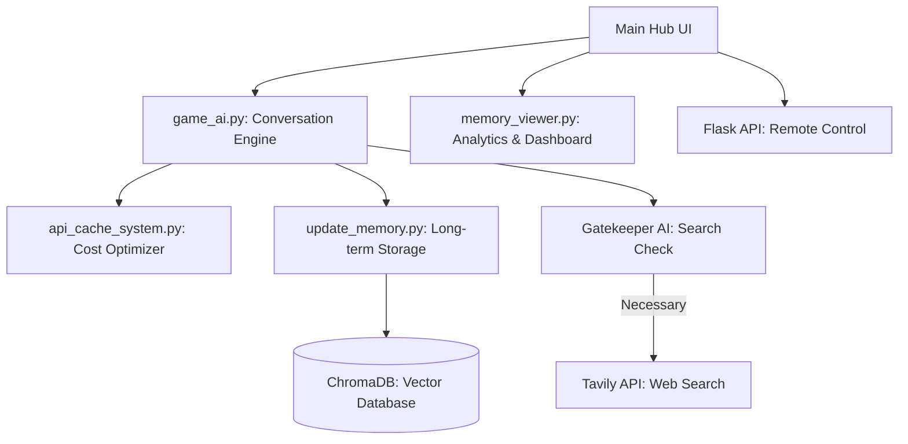

# SecreAI - 高性能AI秘書システム (Ver 1.2.1)

SecreAIは、Google Geminiをコアエンジンに据え、ウェブ検索、画像認識、長期記憶、音声合成を統合した次世代のAIアシスタントです。ゲーム中や作業中に邪魔にならないオーバーレイUIを備え、あなたの「相棒」として成長していきます。

---

## 🚀 主要機能 (Ver 1.2.1)

- **マルチモーダル対話**: テキスト、音声、視覚（画面キャプチャ）を組み合わせた自然な対話。
- **ゲートキーパーAI**: ウェブ検索の必要性を事前に判断し、APIコストを削減しながら最速の回答を提供。
- **多層記憶システム**: 短期・中期・長期の3段階で記憶を管理。会話を重ねるごとにユーザーの好みを学習。
- **パフォーマンスダッシュボード**: 各AIモデル（Gemini, OpenAI, Ollama等）の使用状況をリアルタイムで可視化。
- **インテリジェント最適化**: 徹底したキャッシュ（API/検索）とバックグラウンド並列処理による低レイテンシ体験。
- **RTトランスレーター統合**: OCR・リアルタイム翻訳機能を内蔵。メニューからワンタッチで起動・停止でき、PC負荷に合わせたCPU・感度調整が可能。

---

## 🏗 アーキテクチャ概要

SecreAIは、ハブ（GUI）を中心に、独立したスクリプト群が協調して動作するマイクロサービス的な構成をとっています。

```mermaid
graph TD
    Hub[Main Hub UI] --> GameAI[game_ai.py: Conversation Engine]
    Hub --> MemViewer[memory_viewer.py: Analytics & Dashboard]
    GameAI --> APICache[api_cache_system.py: Cost Optimizer]
    GameAI --> Memory[update_memory.py: Long-term Storage]
    GameAI --> Gatekeeper[Gatekeeper AI: Search Check]
    Gatekeeper -- Necessary --> Search[Tavily API: Web Search]
    Memory --> ChromaDB[(ChromaDB: Vector Database)]
    Hub --> LocalAPI[Flask API: Remote Control]
```

## 📁 リポジトリ・ファイル構成説明

リポジトリ内の各ディレクトリおよびファイルは、以下の役割を担っています。

### 1. 🖥 WPF (C#) フロントエンド・ハブ (`WPF/` ディレクトリ)
WPF(C#)で構築された高性能なGUI操作画面およびオーバーレイUIです。
- **[SecreAI_Hub_Window.cs](file:///D:/SecreAI_Build/WPF/SecreAI_Hub_Window.cs)**: アプリ全体のメインGUI操作ハブ画面。インジケーターランプの制御や、各種Pythonスクリプトの別プロセス安全起動、APIキーなどの管理を担当します。
- **[SecreAI_Hub_Overlay.cs](file:///D:/SecreAI_Build/WPF/SecreAI_Hub_Overlay.cs)**: AIの返答を表示する透過オーバーレイウィンドウ。ディスプレイサイズ（タスクバー除く）の縦幅100%に自動的にフィットし、文字数とアバター画像の有無に合わせてフォントサイズを自動測定して綺麗に収める（スクロールさせない）動的スケールロジックを持ちます。
- **[SecreAI_Hub_Server.cs](file:///D:/SecreAI_Build/WPF/SecreAI_Hub_Server.cs)**: Pythonエンジン（`game_ai.py`など）や外部アプリ（Stream Deck等）からのAPI要求（ログ転送、オーバーレイ表示、状態変更等）を受け付けるローカルFlask代替HTTPサーバー。
- **[MainWindow.cs](file:///D:/SecreAI_Build/WPF/MainWindow.cs) / [WindowCapturer.cs](file:///D:/SecreAI_Build/WPF/WindowCapturer.cs)**: RTT（リアルタイム翻訳）で画面の一部をキャプチャし、半透明のオーバーレイに描画するためのC#側ロジック。
- **[SecreAI_Hub.csproj](file:///D:/SecreAI_Build/WPF/SecreAI_Hub.csproj)**: ハブアプリケーションをコンパイルするためのC#プロジェクト定義ファイル。

### 2. 🐍 Python スクリプト群 (`scripts/` ディレクトリ)
AIのロジック、データベース処理、バックグラウンド並列処理などを担当する Python スクリプト群です。
- **[game_ai.py](file:///D:/SecreAI_Build/scripts/game_ai.py)**: AI対話の中核エンジン。音声認識(STT)、画像認識(Vision)、文字チャットの入力を処理し、GeminiやOpenAIのAPIに問い合わせます。プログラム終了時にはスレッドプールを安全にシャットダウンし、ゾンビ化を防ぎます。
- **[intersecting_ai.py](file:///D:/SecreAI_Build/scripts/intersecting_ai.py)**: ユーザーの質問に対し、Google Grounding検索とTavily検索を並行非同期（`asyncio.gather`）で実行し、事実確認を高度化させる複合AIモデル。
- **[update_memory.py](file:///D:/SecreAI_Build/scripts/update_memory.py)**: 過去の対話履歴から重要な要点・事実のみを抽出し、ChromaDBベクターデータベースに書き込むバックグラウンド記憶最適化スクリプト。
- **[memory_viewer.py](file:///D:/SecreAI_Build/scripts/memory_viewer.py)**: ベクターデータベース（ChromaDB）内の長期記憶を検索・閲覧・削除したり、各モデルの統計グラフを表示するダッシュボード画面。
- **[chromadb_pool.py](file:///D:/SecreAI_Build/scripts/chromadb_pool.py)**: ChromaDB接続をプール（キャッシュ）し、記憶のベクトル検索や読み込み速度を3〜5倍に高速化するモジュール。
- **[api_cache_system.py](file:///D:/SecreAI_Build/scripts/api_cache_system.py)**: 同一の質問や画像付き要求に対し、Gemini/OpenAI等のレスポンスをローカルに一時キャッシュ（TTL指定）することで、応答速度を爆速化（0.1s）しAPI費用を節約するキャッシュ。
- **[config_manager.py](file:///D:/SecreAI_Build/scripts/config_manager.py)**: `data/config.json` 等の設定を破損せずに安全に排他ロード・セーブする共通ユーティリティ。
- **[clear_history.py](file:///D:/SecreAI_Build/scripts/clear_history.py)**: 長期記憶データベースと同期しながらチャットログ履歴を初期化するスクリプト。
- **[stop_ai.py](file:///D:/SecreAI_Build/scripts/stop_ai.py)**: 稼働中のAIのAPI呼び出しやVOICEVOX/Edge-TTSによる音声読み上げを、シグナルを介して即座に強制停止させる制御用スクリプト。

### 3. 🔍 リアルタイム翻訳エンジン (`RTtranslator/` ディレクトリ)
画面内の文字を認識（OCR）して自動翻訳し、画面上に透過レイヤーで重ね合わせるエンジンです。
- **[main.py](file:///D:/SecreAI_Build/RTtranslator/main.py)**: リアルタイム翻訳プロセスの起動・制御を行うメインエントリー。
- **[src/capture.py](file:///D:/SecreAI_Build/RTtranslator/src/capture.py)**: `dxcam` や `mss` ライブラリを使用して、ゲーム画面を超低遅延でキャプチャするモジュール。
- **[src/ocr.py](file:///D:/SecreAI_Build/RTtranslator/src/ocr.py)**: Windows 10/11内蔵の高速OCR（WinRT経由）またはPaddleOCRを使用して、キャプチャされた画像から高精度にテキスト領域を検出するモジュール。
- **[src/translator.py](file:///D:/SecreAI_Build/RTtranslator/src/translator.py)**: 検出されたテキストを、ローカルOllama（Gemma/Llama等）やWeb APIを通じて指定言語に翻訳するモジュール。
- **[src/ui.py](file:///D:/SecreAI_Build/RTtranslator/src/ui.py)**: 翻訳されたテキストをゲーム画面上にぴったりと透過オーバーレイ表示するUI制御モジュール。

### 4. 🛠 ビルド・パッケージ自動化スクリプト (ルートディレクトリ)
アプリのビルド、最適化、配布パッケージの作成を全自動で行うスクリプト群です。
- **[build.bat](file:///D:/SecreAI_Build/build.bat)**: C#コードのビルド、ポータブルPythonランタイムの構築、Inno Setupコンパイルを一括して全自動で行う統合ビルドバッチ。
- **[build_wpf.bat](file:///D:/SecreAI_Build/build_wpf.bat)**: MSBuildを適切なプラットフォーム・フレームワーク設定で呼び出し、C#フロントエンド（Hub & Overlay）をクリーンビルドするスクリプト。
- **[build_python_runtime.py](file:///D:/SecreAI_Build/build_python_runtime.py)**: ユーザー環境にPythonが無くても動作するよう、軽量ポータブルPython（embeddable）を自動ダウンロードし、TavilyやPyAudio等の必須ライブラリを組み込んで最適構築するスクリプト。
- **[setup_script.iss](file:///D:/SecreAI_Build/setup_script.iss)**: Inno Setupによるインストーラーの定義ファイル。不要なキャッシュや個人データ等を除外してクリーンな配布パッケージ（Setup.exe）を作るルールが記述されています。
- **[kill_zombies.bat](file:///D:/SecreAI_Build/kill_zombies.bat)**: 開発時や異常終了時にバックグラウンドに残存した `RTtranslator_core.exe` や `SecreAI_Hub.exe` などの全プロセスを安全に一括強制終了するデバッグ用ツール。
- **[update_lang.py](file:///D:/SecreAI_Build/update_lang.py)**: 新機能追加で更新された日本語設定（`ja.json`）のキーを検出し、他9カ国語（英語、韓国語、中国語等）の設定ファイルへ自動的にGemini APIで高品質翻訳して同期・追加するドキュメントローカライズ支援スクリプト。
- **[overlay.html](file:///D:/SecreAI_Build/overlay.html)**: OBS Studio等の配信ソフトに、翻訳字幕などを直接流し込むための透過背景ウェブオーバーレイファイル。

---

## 💡 AIモデルの特徴とコストについて (2026年5月現在)

初めて利用される方向けに、各AIモデルの性能と気になるコスト面について解説します。

### 1. Google Gemini (メインエンジン)
本システムのメインとなるAIです。以下のモデルを選択可能です。

- **Gemini-3.5-flash**: **[おすすめ]** 4段階の「思考レベル」（最小/低/中/高）を調整可能な最新世代の超高速・高性能モデル。
- **Gemini-3.5-pro**: 複雑な推論や高度な分析に最適化された強力なフラグシップモデル。
- **Gemini-3.1-pro-preview / Gemini-3-flash-preview**: 次世代のプレビューモデル。

> [!IMPORTANT]
> **Gemini の利用制限と無料枠**
> - **完全無料での利用**: APIキーをそのまま使う場合、各モデル1日20回程度に制限されます。また、入力したデータはAIの学習に使用される可能性があります。
> - **無料枠の活用**: クレジットカードを紐付けると、**300ドル分（有効期限3か月）の無料クレジット**がもらえます。個人利用の範囲では、この期間内はほぼ無料でフル活用可能です。

### 2. OpenAI (オプション)
さらに高度な知能や、特定のモデルを使用したい場合に利用します。

- **gpt-5.5 / gpt-5.4 / gpt-5.4-mini / gpt-5.4-nano / gpt-5**: 思考レベル付きのモデルも含め、業界最高水準の推論能力と知識量を持つモデルが選択可能です。

> [!TIP]
> **OpenAI のコストメリット**
> - 5ドル以上をチャージ（プリペイド）し「学習を許可する設定」することで、1日あたり**250,000トークン分の無料枠**が付与されます。これにより、日常的な対話のコストを大幅に抑えることが可能です。

### 3. Tavily AI (ウェブ検索)
AIが最新の情報をインターネットから検索するために使用します。

- **利用料金**: 毎月 **1,000回まで無料** で検索可能です。
- **特徴**: ゲートキーパーAIが「検索が必要な時だけ」呼び出すため、無料枠内でも十分に長期間利用できます。

> [!WARNING]
> **プライバシーについて**
> 各サービスの「無料枠」や「学習を許可する設定」で利用する場合、会話内容がAIの改善（学習）に使用されることがあります。機密情報を入力する際は、各社の有料プランやオプトアウト設定をご確認ください。

---

### 2. サポートツール
- **VOICEVOX**: 日本語音声読み上げに必要。 [公式サイト](https://voicevox.hiroshiba.jp/) からvv-engineを起動してください。
- **Ollama**: ローカルでの高度な要約・思考に使用（任意）。 [ollama.com](https://ollama.com/)
- **SubtitLocar**: ローカルAI字幕システムとの連携に使用（任意）。 [GitHub](https://github.com/tomatofhis-commits/SubtitLocar)

---

## 📖 使い方ガイド

### 初期セットアップ
初回起動時に **セットアップウィザード** が起動します。言語設定からAPIキーの入力まで、ステップバイステップで完了します。

### 基本操作
- **ボイスモード**: マイクアイコンまたはショートカットで起動。ハンズフリーでの対話が可能です。
- **ビジョンモード**: アクティブなウィンドウ（ゲーム等）をAIに見せて質問できます。
- **フィードバック**: AIの回答が良かったら「Good」、悪かったら「Bad」を押してください。AIがその理由を自己分析し、次回の回答を改善します。

### 記憶の管理
メニューの「記憶管理」から、AIがこれまでに蓄積した長期記憶の内容を確認したり、モデル別の使用統計（ダッシュボード）を閲覧できます。

---

## ⚙️ 高度な最適化機能

### APIキャッシュシステム
同一の質問、画像に対しては再計算を行わず、キャッシュから即座に回答します。
- **メリット**: 応答速度が0.1秒以下になり、API消費（コスト）もゼロになります。
- **設定**: `config/config.json` 内の `API_CACHE_TTL_HOURS` で保持期間（デフォルト24h）を調整可能。

### 検索ループの抑制 (Gatekeeper)
「今の天気は？」のような検索必須な質問と、「1+1は？」のような検索不要な質問をAIが自動判別。無駄なAPI呼び出しを徹底的に排除します。

### リアルタイム翻訳 (RTトランスレーター)
画面上のテキストを検知し、オーバーレイ表示で翻訳します。
- **ワンショット翻訳モード**: [New] ボタンを押した瞬間の画面を1回だけスキャンし、すべての翻訳が完了するまで表示を維持するモードです。ストーリーをじっくり読みたいシーンや、PCの負荷を最小限に抑えたい場合に最適です。
- **パフォーマンス調整**: 設定の「RTトランスレーター」タブから、CPU使用制限（25%〜100%）や検知感度を変更できます。
- **環境最適化**: 動きの激しいゲームでは感度を下げ、静止画に近い場合は感度を上げることで、CPU負荷と翻訳速度のバランスを最適化できます。

### 🎮 配信・録画 (OBS) での表示方法
実況配信や録画で翻訳字幕を表示したい場合は、以下の **「ブラウザソース」** を使う方法を推奨します。

1. **ブラウザソース (推奨 / Browser Source)**
   - OBSのソース追加で「ブラウザ」を選択。
   - **URL**: `http://localhost:5001/overlay`
   - **幅/高さ**: ゲームの解像度（例: 1920x1080）に合わせてください。
   - **メリット**: 背景が最初から透過しており、ゲーム画面の上に重ねるだけでプロフェッショナルな翻訳字幕が表示されます。

2. **ウィンドウキャプチャ (Window Capture)**
   - ブラウザソースが使えない場合の予備手段です。
   - ソース追加で「ウィンドウキャプチャ」を選択し、`RTT_Overlay` を指定。
   - **ポイント**: OBSのプロパティで「キャプチャ方法」を **「Windows 10 (1903 以降)」** に設定してください。

3. **画面キャプチャ (Display Capture)**
   - デスクトップに表示されている通りに、すべてをセットでキャプチャします。

---

## 🎮 Stream Deck との強力な連携

SecreAIの真価は、ゲームプレイを妨げずに**ワンタッチでAIと対話できる**点にあります。Elgato Stream Deckやスマートフォン用アプリを使用することで、フルスクリーンゲーム中でも視線を外さずにAIを操作可能です。

### 設定方法
Stream Deckアプリで「**Webサイト**」アクションをボタンに割り当て、以下の設定を行ってください。

1. **URL**: 各機能のエンドポイント（下記参照）を入力。
2. **背景でGETリクエストを実行**: **必ずチェックを入れてください**。これにより、ブラウザを立ち上げずに裏側でAIが動作します。

### API エンドポイント一覧

| 機能 | URL (デフォルト) | 説明 |
| :--- | :--- | :--- |
| **ボイスモード** | `http://localhost:5000/api/voice` | AIが「質問は何ですか？」と聞き受けます。 |
| **ビジョンモード** | `http://localhost:5000/api/vision` | 現在のゲーム画面をAIに見せて質問します。 |
| **おしゃべり停止** | `http://localhost:5000/api/stop` | AIの回答や読み上げを即座に中断します。 |
| **Good評価** | `http://localhost:5000/api/feedback_good` | AIの今の回答を褒め、学習を促進します。 |
| **Bad評価** | `http://localhost:5000/api/feedback_bad` | 回答の不備を指摘し、改善を促します。 |
| **履歴の修正** | `http://localhost:5000/api/fix` | 直前の回答に「間違い」マークを付与します。 |
| **会話リセット** | `http://localhost:5000/api/clear` | **[重要]** 記憶を整理（同期）した上で会話内容をクリアします。 |
| **設定画面** | `http://localhost:5000/api/settings` | 設定パネルをフォアグラウンドに表示します。 |
| **RTT 翻訳開始** | `http://localhost:5000/api/rtt_start` | リアルタイム翻訳（OCR）を開始。 |
| **RTT 翻訳停止** | `http://localhost:5000/api/rtt_stop` | リアルタイム翻訳を即座に停止。 |
| **RTT 翻訳リセット** | `http://localhost:5000/api/rtt_retrans` | 表示中の翻訳を消去し、再スキャンを強制します。 |
| **RTT 状態確認** | `http://localhost:5000/api/rtt_status` | RTTプロセスの稼働状態（実行中/停止中）とエラーを確認。 |
| **RTT エコモード切替** | `http://localhost:5000/api/ecomode` | RTTのエコモードをON/OFFします。 |

> [!TIP]
> 「クリア」エンドポイントは、UIの「ログ消去」と異なり、会話内容を長期記憶としてデータベースに定着させた後に履歴をリセットします。セッションの区切りで使用することを推奨します。

---

## 📜 免責事項
本ソフトウェアは現状有姿で提供されます。AIによる誤回答、API利用に伴う課金、データの損失等について、制作者は一切の責任を負いません。API利用状況は、Hub内のダッシュボードで常に確認することを推奨します。

---
© 2026 SecreAI Dev Team. Created for the best companion experience.
