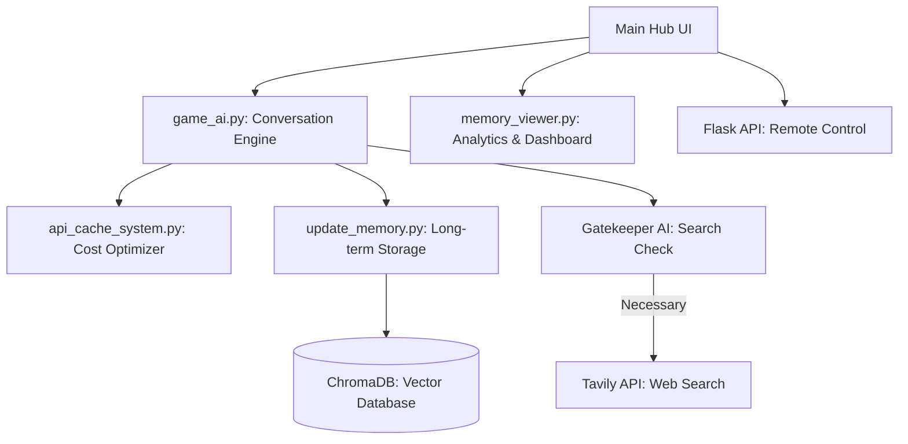

# SecreAI - 高性能AI秘書システム / High-Performance AI Assistant System (Ver 1.3.1)

SecreAIは、Google Geminiをコアエンジンに据え、ウェブ検索、画像認識、長期記憶、音声合成を統合した次世代のAIアシスタントです。ゲーム中や作業中に邪魔にならないオーバーレイUIを備え、あなたの「相棒」として成長していきます。  
*SecreAI is a next-generation AI assistant powered by Google Gemini as its core engine, integrating web search, image recognition, long-term memory, and speech synthesis. Featuring a non-intrusive overlay UI designed for gaming or working, it evolves into your personalized companion.*

---

## 主要機能 / Key Features (Ver 1.3.1)

- **マルチモーダル対話 / Multimodal Interaction**: テキスト、音声、視覚（画面キャプチャ）を組み合わせた自然な対話。  
  *Natural conversations combining text, voice, and vision (screen capture).*
- **ゲートキーパーAI / Gatekeeper AI**: ウェブ検索の必要性を事前に判断し、APIコストを削減しながら最速の回答を提供。  
  *Predicts search necessity in advance to cut API costs while delivering the fastest responses.*
- **多層記憶システム / Multi-Layered Memory**: 短期・中期・長期の3段階で記憶を管理。会話を重ねるごとにユーザーの好みを学習。  
  *Manages memory across 3 stages (short, mid, and long-term), learning user preferences over time.*
- **パフォーマンスダッシュボード / Performance Dashboard**: 各AIモデル（Gemini, OpenAI, Ollama / LM Studio等）の使用状況をリアルタイムで可視化。  
  *Real-time visualization of resource usage across AI models (Gemini, OpenAI, Ollama / LM Studio, etc.).*
- **インテリジェント最適化 / Intelligent Optimization**: 徹底したキャッシュ（API/検索）とバックグラウンド並列処理による低レイテンシ体験。  
  *Low-latency experience achieved through aggressive caching (API/search) and background parallel processing.*
- **RTトランスレーター統合 / Integrated Real-time Translator**: OCR・リアルタイム翻訳機能を内蔵。メニューからワンタッチで起動・停止でき、PC負荷に合わせたCPU・感度調整が可能。  
  *Built-in OCR and real-time translation features. Easily start/stop from the menu with adjustable CPU/sensitivity controls.*

---

## アーキテクチャ概要 / Architecture Overview

SecreAIは、ハブ（GUI）を中心に、独立したスクリプト群が協調して動作するマイクロサービス的な構成をとっています。  
*SecreAI adopts a microservice-like architecture where independent scripts operate cooperatively around a central Hub (GUI).*

```mermaid
graph TD
    Hub[Main Hub UI] --> GameAI[game_ai.py: Conversation Engine]
    Hub --> MemViewer[memory_viewer.py: Analytics & Dashboard]
    GameAI --> APICache[api_cache_system.py: Cost Optimizer]
    GameAI --> Memory[update_memory.py: Long-term Storage]
    GameAI --> Gatekeeper[Gatekeeper AI: Search Check]
    Gatekeeper -- Necessary --> Search[Tavily API: Web Search]
    Memory --> ChromaDB[(ChromaDB: Vector Database)]
    Hub --> LocalAPI[Flask API: Remote Control]
```

---

## リポジトリ・ファイル構成説明 / Directory & File Structure

リポジトリ内の各ディレクトリおよびファイルは、以下の役割を担っています。  
*Each directory and file in the repository serves the following dedicated roles:*

### 1. WPF (C#) フロントエンド・ハブ / Frontend Hub (`WPF/`)
WPF(C#)で構築された高性能なGUI操作画面およびオーバーレイUIです。  
*High-performance GUI control panel and overlay UI built with WPF (C#).*

- **[SecreAI_Hub_Window.cs](file:///D:/SecreAI_Build/WPF/SecreAI_Hub_Window.cs)**: アプリ全体のメインGUI操作ハブ画面。インジケーターランプの制御や、各種Pythonスクリプトの別プロセス安全起動、APIキーなどの管理を担当します。  
  *Main GUI control hub. Manages indicator lamps, process management for Python scripts, and API keys.*
- **[SecreAI_Hub_Overlay.cs](file:///D:/SecreAI_Build/WPF/SecreAI_Hub_Overlay.cs)**: AIの返答を表示する透過オーバーレイウィンドウ。ディスプレイサイズ（タスクバー除く）の縦幅100%に自動的にフィットし、文字数とアバター画像の有無に合わせてフォントサイズを自動測定して綺麗に収める（スクロールさせない）動的スケールロジックを持ちます。  
  *Transparent overlay window displaying AI responses. Features dynamic font scaling to fit 100% display height without scrolling.*
- **[SecreAI_Hub_Server.cs](file:///D:/SecreAI_Build/WPF/SecreAI_Hub_Server.cs)**: Pythonエンジン（`game_ai.py`など）や外部アプリ（Stream Deck等）からのAPI要求（ログ転送、オーバーレイ表示、状態変更等）を受け付けるローカルFlask代替HTTPサーバー。  
  *Local HTTP server handling API requests (logs, overlay, status) from Python engines and external apps.*
- **[MainWindow.cs](file:///D:/SecreAI_Build/WPF/MainWindow.cs) / [WindowCapturer.cs](file:///D:/SecreAI_Build/WPF/WindowCapturer.cs)**: RTT（リアルタイム翻訳）で画面の一部をキャプチャし、半透明のオーバーレイに描画するためのC#側ロジック。  
  *C# logic for capturing screen areas and rendering semi-transparent overlays for Real-time Translation (RTT).*
- **[SecreAI_Hub.csproj](file:///D:/SecreAI_Build/WPF/SecreAI_Hub.csproj)**: ハブアプリケーションをコンパイルするためのC#プロジェクト定義ファイル。  
  *C# project definition file used to compile the Hub application.*

### 2. Python スクリプト群 / Python Scripts (`scripts/`)
AIのロジック、データベース処理、バックグラウンド並列処理などを担当する Python スクリプト群です。  
*Python scripts responsible for AI logic, database handling, and background parallel processing.*

- **[game_ai.py](file:///D:/SecreAI_Build/scripts/game_ai.py)**: AI対話の中核エンジン。音声認識(STT)、画像認識(Vision)、文字チャットの入力を処理し、GeminiやOpenAIのAPIに問い合わせます。プログラム終了時にはスレッドプールを安全にシャットダウンし、ゾンビ化を防ぎます。  
  *Core AI dialogue engine. Processes STT, Vision, and Chat inputs, querying Gemini/OpenAI APIs with safe thread cleanup.*
- **[intersecting_ai.py](file:///D:/SecreAI_Build/scripts/intersecting_ai.py)**: ユーザーの質問に対し、Google Grounding検索とTavily検索を並行非同期（`asyncio.gather`）で実行し、事実確認を高度化させる複合AIモデル。  
  *Hybrid AI model executing Google Grounding and Tavily searches concurrently (`asyncio.gather`) for accurate fact-checking.*
- **[update_memory.py](file:///D:/SecreAI_Build/scripts/update_memory.py)**: 過去の対話履歴から重要な要点・事実のみを抽出し、ChromaDBベクターデータベースに書き込むバックグラウンド記憶最適化スクリプト。  
  *Background memory script extracting key facts and writing them into the ChromaDB vector database.*
- **[memory_viewer.py](file:///D:/SecreAI_Build/scripts/memory_viewer.py)**: ベクターデータベース（ChromaDB）内の長期記憶を検索・閲覧・削除したり、各モデルの統計グラフを表示するダッシュボード画面。  
  *Dashboard UI for searching/deleting long-term memories in ChromaDB and displaying model statistics.*
- **[chromadb_pool.py](file:///D:/SecreAI_Build/scripts/chromadb_pool.py)**: ChromaDB接続をプール（キャッシュ）し、記憶のベクトル検索や読み込み速度を3〜5倍に高速化するモジュール。  
  *Pools ChromaDB connections, accelerating vector searches and retrieval speeds by 3-5x.*
- **[api_cache_system.py](file:///D:/SecreAI_Build/scripts/api_cache_system.py)**: 同一の質問や画像付き要求に対し、Gemini/OpenAI等のレスポンスをローカルに一時キャッシュ（TTL指定）することで、応答速度を爆速化（0.1s）しAPI費用を節約するキャッシュ。  
  *Caches API responses locally (with TTL), enabling sub-100ms response times and eliminating redundant costs.*
- **[config_manager.py](file:///D:/SecreAI_Build/scripts/config_manager.py)**: `data/config.json` 等の設定を破損せずに安全に排他ロード・セーブする共通ユーティリティ。  
  *Common utility safely loading and saving `data/config.json` with thread safety.*
- **[clear_history.py](file:///D:/SecreAI_Build/scripts/clear_history.py)**: 長期記憶データベースと同期しながらチャットログ履歴を初期化するスクリプト。  
  *Resets chat log history while synchronizing and updating long-term memories.*
- **[stop_ai.py](file:///D:/SecreAI_Build/scripts/stop_ai.py)**: 稼働中のAIのAPI呼び出しやVOICEVOX/Edge-TTSによる音声読み上げを、シグナルを介して即座に強制停止させる制御用スクリプト。  
  *Control script sending signals to instantly halt ongoing AI API calls and voice synthesis.*

### 3. リアルタイム翻訳エンジン / Real-time Translation Engine (`RTtranslator/`)
画面内の文字を認識（OCR）して自動翻訳し、画面上に透過レイヤーで重ね合わせるエンジンです。  
*Engine that recognizes screen text (OCR), translates it, and renders a transparent overlay on top.*

- **[main.py](file:///D:/SecreAI_Build/RTtranslator/main.py)**: リアルタイム翻訳プロセスの起動・制御を行うメインエントリー。  
  *Main entry point controlling the Real-Time Translator process.*
- **[src/capture.py](file:///D:/SecreAI_Build/RTtranslator/src/capture.py)**: `dxcam` や `mss` ライブラリを使用して、ゲーム画面を超低遅延でキャプチャするモジュール。  
  *Ultra-low latency screen capture module using `dxcam` and `mss`.*
- **[src/ocr.py](file:///D:/SecreAI_Build/RTtranslator/src/ocr.py)**: Windows 10/11内蔵の高速OCR（WinRT経由）またはPaddleOCRを使用して、キャプチャされた画像から高精度にテキスト領域を検出するモジュール。  
  *OCR module detecting text areas using Windows WinRT OCR or PaddleOCR.*
- **[src/translator.py](file:///D:/SecreAI_Build/RTtranslator/src/translator.py)**: 検出されたテキストを、ローカルOllama（Gemma/Llama等）やWeb APIを通じて指定言語に翻訳するモジュール。  
  *Translates detected text via local Ollama (Gemma/Llama) or cloud Web APIs.*
- **[src/ui.py](file:///D:/SecreAI_Build/RTtranslator/src/ui.py)**: 翻訳されたテキストをゲーム画面上にぴったりと透過オーバーレイ表示するUI制御モジュール。  
  *UI control module rendering translated text transparently over game windows.*

### 4. ビルド・パッケージ自動化スクリプト / Build & Automation Scripts
アプリのビルド、最適化、配布パッケージの作成を全自動で行うスクリプト群です。  
*Scripts automating application builds, runtime optimization, and setup package creation.*

- **[build.bat](file:///D:/SecreAI_Build/build.bat)**: C#コードのビルド、ポータブルPythonランタイムの構築、Inno Setupコンパイルを一括して全自動で行う統合ビルドバッチ。  
  *All-in-one build batch script compiling C#, preparing Python runtime, and generating setup installers.*
- **[build_wpf.bat](file:///D:/SecreAI_Build/build_wpf.bat)**: MSBuildを適切なプラットフォーム・フレームワーク設定で呼び出し、C#フロントエンド（Hub & Overlay）をクリーンビルドするスクリプト。  
  *Build script invoking MSBuild to perform clean builds of the WPF frontend (Hub & Overlay).*
- **[build_python_runtime.py](file:///D:/SecreAI_Build/build_python_runtime.py)**: ユーザー環境にPythonが無くても動作するよう、軽量ポータブルPython（embeddable）を自動ダウンロードし、TavilyやPyAudio等の必須ライブラリを組み込んで最適構築するスクリプト。  
  *Script downloading embeddable Python and assembling a self-contained runtime with required packages.*
- **[setup_script.iss](file:///D:/SecreAI_Build/setup_script.iss)**: Inno Setupによるインストーラーの定義ファイル。不要なキャッシュや個人データ等を除外してクリーンな配布パッケージ（Setup.exe）を作るルールが記述されています。  
  *Inno Setup definition file creating clean installer packages (Setup.exe) without temporary data.*
- **[kill_zombies.bat](file:///D:/SecreAI_Build/kill_zombies.bat)**: 開発時や異常終了時にバックグラウンドに残存した `RTtranslator_core.exe` や `SecreAI_Hub.exe` などの全プロセスを安全に一括強制終了するデバッグ用ツール。  
  *Debug script force-closing any leftover background processes (`RTtranslator_core.exe`, `SecreAI_Hub.exe`).*
- **[update_lang.py](file:///D:/SecreAI_Build/update_lang.py)**: 新機能追加で更新された日本語設定（`ja.json`）のキーを検出し、他9カ国語（英語、韓国語、中国語等）の設定ファイルへ自動的にGemini APIで高品質翻訳して同期・追加するドキュメントローカライズ支援スクリプト。  
  *Localization script detecting new keys in `ja.json` and translating them into 9 languages via Gemini API.*
- **[overlay.html](file:///D:/SecreAI_Build/overlay.html)**: OBS Studio等の配信ソフトに、翻訳字幕などを直接流し込むための透過背景ウェブオーバーレイファイル。  
  *Transparent web overlay file for streaming software like OBS Studio.*

---

## AIモデルの特徴とコストについて / AI Models & Cost Overview

初めて利用される方向けに、各AIモデルの性能と気になるコスト面について解説します。  
*An overview of AI model performance and cost considerations for new users.*

### 1. Google Gemini (メインエンジン / Main Engine)
本システムのメインとなるAIです。以下のモデルを選択可能です。  
*The primary AI engine of the system. The following models are available:*

- **Gemini-3.6-flash**: **[おすすめ / Recommended]** 思考レベル（高/中/低/最小）を調整可能な最新の超高速・高コスパモデル。  
  *Latest ultra-fast, cost-effective model supporting customizable thinking levels (High/Medium/Low/Minimal).*
- **Gemini-3.5-flash-lite**: **[軽量 / Lightweight]** 思考レベル（高/中）に対応し、軽量かつ低コストで運用可能なモデル。  
  *Lightweight and low-cost model supporting thinking levels (High/Medium).*
- **Gemini-3.1-pro-preview / Gemini-3-flash-preview**: 複雑な推論や高度な分析に対応するプレビューモデル。  
  *Preview models suitable for complex reasoning and advanced analysis.*

> [!IMPORTANT]
> **Gemini の利用制限と無料枠 / Gemini Free Tier & Limits**
> - **完全無料での利用 / Completely Free Use**: APIキーをそのまま使う場合、各モデル1日20回程度に制限されます。また、入力したデータはAIの学習に使用される可能性があります。  
>   *Direct API key usage without credit cards limits requests to ~20/day per model, and inputs may be used for training.*
> - **無料枠の活用 / Utilizing Free Credits**: クレジットカードを紐付けると、**300ドル分（有効期限3か月）の無料クレジット**がもらえます。個人利用の範囲では、この期間内はほぼ無料でフル活用可能です。  
>   *Linking a credit card provides **$300 in free credits (valid for 3 months)**, covering most personal use for free.*

### 2. OpenAI (オプション / Optional)
さらに高度な知能や、特定のモデルを使用したい場合に利用します。  
*Used when specific models or higher intelligence levels are required.*

- **gpt-5.5 / gpt-5.4 / gpt-5.4-mini / gpt-5.4-nano / gpt-5**: 思考レベル付きのモデルも含め、業界最高水準の推論能力と知識量を持つモデルが選択可能です。  
  *Industry-leading models featuring superior reasoning capabilities and knowledge bases.*

> [!TIP]
> **OpenAI のコストメリット / OpenAI Cost Advantage**
> - 5ドル以上をチャージ（プリペイド）し「学習を許可する設定」することで、1日あたり**250,000トークン分の無料枠**が付与されます。これにより、日常的な対話のコストを大幅に抑えることが可能です。  
>   *Prepaying $5+ and enabling data sharing grants **250,000 free tokens per day**, significantly reducing daily costs.*

### 3. Tavily AI (ウェブ検索 / Web Search)
AIが最新の情報をインターネットから検索するために使用します。  
*Used by AI to retrieve up-to-date information from the Internet.*

- **利用料金 / Pricing**: 毎月 **1,000回まで無料** で検索可能です。  
  *Free up to **1,000 searches per month**.*
- **特徴 / Features**: ゲートキーパーAIが「検索が必要な時だけ」呼び出すため、無料枠内でも十分に長期間利用できます。  
  *Called only when Gatekeeper AI determines search is necessary, preserving free tier limits for months.*

---

## 使い方ガイド / User Guide

### 初期セットアップ / Initial Setup
初回起動時に **セットアップウィザード** が起動します。言語設定からAPIキーの入力まで、ステップバイステップで完了します。  
*A **Setup Wizard** runs on first launch, guiding you step-by-step from language selection to API key setup.*

### 基本操作 / Basic Controls
- **ボイスモード / Voice Mode**: マイクアイコンまたはショートカットで起動。ハンズフリーでの対話が可能です。  
  *Activated via mic icon or hotkey for hands-free conversations.*
- **ビジョンモード / Vision Mode**: アクティブなウィンドウ（ゲーム等）をAIに見せて質問できます。  
  *Allows the AI to analyze your active game or application window.*
- **フィードバック / Feedback**: AIの回答が良かったら「Good」、悪かったら「Bad」を押してください。AIがその理由を自己分析し、次回の回答を改善します。  
  *Rate responses as "Good" or "Bad". The AI self-analyzes ratings to improve future answers.*

### 記憶の管理 / Memory Management
メニューの「記憶管理」から、AIがこれまでに蓄積した長期記憶の内容を確認したり、モデル別の使用統計（ダッシュボード）を閲覧できます。  
*Access "Memory Management" from the menu to inspect accumulated long-term memories and view usage dashboards.*

---

## 高度な最適化機能 / Advanced Optimization Features

### APIキャッシュシステム / API Caching System
同一の質問、画像に対しては再計算を行わず、キャッシュから即座に回答します。  
*Reuses answers instantly for identical questions or images without re-querying APIs.*

- **メリット / Benefits**: 応答速度が0.1秒以下になり、API消費（コスト）もゼロになります。  
  *Delivers sub-100ms response speeds with zero API cost.*
- **設定 / Configuration**: `config/config.json` 内の `API_CACHE_TTL_HOURS` で保持期間（デフォルト24h）を調整可能。  
  *Adjust cache retention time (default 24h) via `API_CACHE_TTL_HOURS` in `config/config.json`.*

### 検索ループの抑制 (Gatekeeper) / Search Suppression (Gatekeeper)
「今の天気は？」のような検索必須な質問と、「1+1は？」のような検索不要な質問をAIが自動判別。無駄なAPI呼び出しを徹底的に排除します。  
*Automatically distinguishes between search-dependent questions (e.g., weather) and basic queries to eliminate wasted API calls.*

### リアルタイム翻訳 (RTトランスレーター) / Real-Time Translator (RTT)
画面上のテキストを検知し、オーバーレイ表示で翻訳します。  
*Detects text on screen and displays live translated overlays.*

- **ワンショット翻訳モード / One-Shot Mode**: ボタンを押した瞬間の画面を1回だけスキャンし、すべての翻訳が完了するまで表示を維持するモードです。ストーリーをじっくり読みたいシーンや、PCの負荷を最小限に抑えたい場合に最適です。  
  *Scans screen once on button press and maintains overlays until complete. Ideal for reading storyline cutscenes with minimal CPU load.*
- **パフォーマンス調整 / Performance Tuning**: 設定の「RTトランスレーター」タブから、CPU使用制限（25%〜100%）や検知感度を変更できます。  
  *Adjust CPU thread limits (25%-100%) and OCR sensitivity in the RTT settings tab.*

---

## 配信・録画 (OBS) での表示方法 / Streaming & Recording (OBS Setup)

実況配信や録画で翻訳字幕を表示したい場合は、以下の **「ブラウザソース」** を使う方法を推奨します。  
*For streaming or recording translated overlays in OBS, using a **Browser Source** is recommended.*

1. **ブラウザソース (推奨 / Browser Source)**
   - OBSのソース追加で「ブラウザ」を選択。  
     *Add a new "Browser Source" in OBS.*
   - **URL**: `http://localhost:5001/overlay`
   - **幅/高さ / Width & Height**: ゲームの解像度（例: 1920x1080）に合わせてください。  
     *Set to match your game's screen resolution (e.g., 1920x1080).*
   - **メリット / Benefits**: 背景が最初から透過しており、ゲーム画面の上に重ねるだけでプロフェッショナルな翻訳字幕が表示されます。  
     *Features transparent backgrounds by default for clean overlay rendering.*

2. **ウィンドウキャプチャ (Window Capture)**
   - ソース追加で「ウィンドウキャプチャ」を選択し、`RTT_Overlay` を指定。  
     *Select "Window Capture" in OBS and specify `RTT_Overlay`.*
   - **ポイント / Note**: OBSのプロパティで「キャプチャ方法」を **「Windows 10 (1903 以降)」** に設定してください。  
     *Set Capture Method to **"Windows 10 (1903 and up)"** in OBS properties.*

---

## Stream Deck との強力な連携 / Stream Deck Integration

SecreAIの真価は、ゲームプレイを妨げずに**ワンタッチでAIと対話できる**点にあります。Elgato Stream Deckやスマートフォン用アプリを使用することで、フルスクリーンゲーム中でも視線を外さずにAIを操作可能です。  
*Control SecreAI seamlessly during gameplay without leaving full-screen mode using Elgato Stream Deck or mobile apps.*

### 設定方法 / Setup Instructions
Stream Deckアプリで「**Webサイト**」アクションをボタンに割り当て、以下の設定を行ってください。  
*Assign a **"Website"** action to a button in the Stream Deck app with the following configuration:*

1. **URL**: 各機能のエンドポイント（下記参照）を入力。  
   *Enter the target API endpoint URL (see table below).*
2. **背景でGETリクエストを実行 / GET Request in Background**: **必ずチェックを入れてください**。これにより、ブラウザを立ち上げずに裏側でAIが動作します。  
   ***Check this option** to execute requests silently without launching a browser window.*

### API エンドポイント一覧 / API Endpoints Table

| 機能 / Feature | URL (デフォルト / Default) | 説明 / Description |
| :--- | :--- | :--- |
| **ボイスモード / Voice Mode** | `http://localhost:5000/api/voice` | AIが音声入力待機状態に入ります。 / *Enters voice input listening mode.* |
| **ビジョンモード / Vision Mode** | `http://localhost:5000/api/vision` | 現在の画面をキャプチャして質問を受け付けます。 / *Captures current screen for AI analysis.* |
| **おしゃべり停止 / Stop Speech** | `http://localhost:5000/api/stop` | AIの回答や音声読み上げを即座に中断します。 / *Instantly halts AI response and TTS playback.* |
| **Good評価 / Rate Good** | `http://localhost:5000/api/feedback_good` | 直前の回答を評価し、学習を促進します。 / *Rates recent response positively to reinforce behavior.* |
| **Bad評価 / Rate Bad** | `http://localhost:5000/api/feedback_bad` | 回答の不備を指摘し、改善を促します。 / *Flags response errors for self-correction.* |
| **履歴の修正 / Mark Fix** | `http://localhost:5000/api/fix` | 直前の回答に「修正要」マークを付与します。 / *Marks recent answer for revision.* |
| **会話リセット / Reset Chat** | `http://localhost:5000/api/clear` | **[重要]** 記憶をデータベースに同期した上で履歴を初期化。 / *[Important] Syncs memory to DB and resets history.* |
| **設定画面 / Open Settings** | `http://localhost:5000/api/settings` | 設定パネルを最前面に表示します。 / *Brings settings window to foreground.* |
| **RTT 翻訳開始 / RTT Start** | `http://localhost:5000/api/rtt_start` | リアルタイム翻訳を開始します。 / *Starts Real-time Translation (OCR).* |
| **RTT 翻訳停止 / RTT Stop** | `http://localhost:5000/api/rtt_stop` | リアルタイム翻訳を停止します。 / *Stops Real-time Translation.* |
| **RTT 翻訳リセット / RTT Reset** | `http://localhost:5000/api/rtt_retrans` | 画面表示を消去し、再スキャンを強制します。 / *Clears overlays and forces re-scan.* |
| **RTT 状態確認 / RTT Status** | `http://localhost:5000/api/rtt_status` | RTTプロセスの稼働状態を確認します。 / *Queries RTT process running status.* |
| **RTT エコモード切替 / Eco Mode** | `http://localhost:5000/api/ecomode` | RTTのエコモードをON/OFFします。 / *Toggles RTT eco mode ON/OFF.* |

> [!TIP]
> 「クリア」エンドポイントは、会話内容を長期記憶データベースに定着させた後に履歴をリセットします。セッションの区切りでの使用を推奨します。  
> *The "Reset Chat" endpoint saves session memories to long-term DB before clearing logs. Recommended at session ends.*

---

## 免責事項 / Disclaimer

本ソフトウェアは現状有姿で提供されます。AIによる誤回答、API利用に伴う課金、データの損失等について、制作者は一切の責任を負いません。API利用状況は、Hub内のダッシュボードで常に確認することを推奨します。  
*This software is provided "as is" without warranties of any kind. The developers assume no responsibility for AI misresponses, API charges, or data loss. Users are encouraged to monitor API usage via the built-in dashboard.*

---

© 2026 SecreAI Dev Team. Created for the best companion experience.
