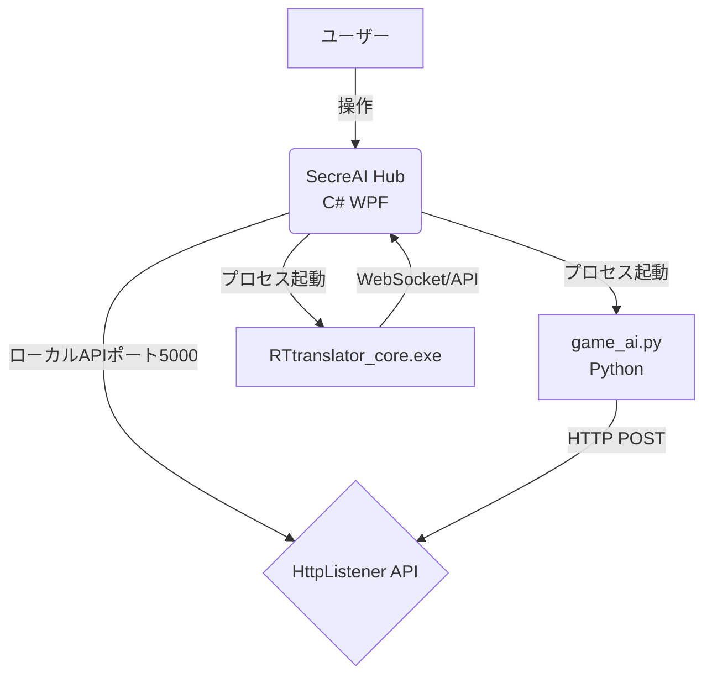

# SecreAI (Beta) & RTtranslator 統合システム構成メモ

本ドキュメントは、ハブ機能を C# WPF 版に一本化し、重複していた Python 版ハブの Nuitka ビルドを廃止した新構成（v1.2.0-beta以降）のシステムアーキテクチャおよび今後の開発・メンテナンス用の参考情報をまとめたものです。

---

## 1. 全体アーキテクチャ

システムは大きく分けて「メインハブ (C# WPF)」「AI応答コア (Python スクリプト群)」「翻訳コア (RTtranslator)」の3層で構成されています。

### ① メインハブ (SecreAI_Hub.exe -> secreAI.exe)
* **役割**: メインGUI（チャット入力、ログ表示、ステータスインジケーター）、システムトレイ常駐、エコモード等の設定変更、外部プロセスの起動・制御。
* **言語/フレームワーク**: C# (WPF, .NET Framework 4.0)
* **APIサーバー**: ポート `5000` で自作の `HttpListener` を常駐起動。PythonスクリプトやRTtranslatorからのログ、オーバーレイ描画要求などの API エンドポイントを提供します。

### ② AI応答・音声処理コア (scripts/game_ai.py など)
* **役割**: Gemini/OpenAI/Ollama などの LLM 呼び出し、ChromaDB を使った記憶検索、Web検索、VOICEVOX / Edge-TTS による音声合成。
* **動作方法**: WPFハブから `python_runtime\python.exe` 経由でプロセスとして呼び出されます。処理結果（音声ファイルの再生、オーバーレイに表示するテキストやキャプチャ画像）は、WPFハブの API ポート `5000` (`/api/log`, `/api/overlay` 等) にHTTPで送信されてGUIに反映されます。

### ③ 翻訳・画面認識コア (RTtranslator_core.exe)
* **役割**: ゲーム画面のキャプチャ、PaddleOCR による文字認識、翻訳処理、翻訳結果のオーバーレイ描画。
* **動作方法**: WPFハブのメニュー「RTトランスレーター」->「開始」からバックグラウンドプロセスとして起動されます。

---

## 2. Python 実行環境の配布とパス解決

Nuitka による Python 版ハブの丸ごとコンパイル（毎回約11分）を廃止したため、Python 実行環境を以下のようにポータブル化して同梱しています。

### ① 配布時の構成
* インストーラー作成時に、最小限のポータブル Python 3.10 環境を `python_runtime` フォルダとして `{app}\python_runtime` 直下に同梱します。
* `python_runtime` 内の `python310._pth` で `import site` が有効化されており、同梱された `site-packages`（ChromaDB, pygame, Flask など）が正しく読み込まれます。

### ② WPF側での起動パス動的解決 (`SecreAI_Hub_Window.cs`)
WPFハブから Python スクリプトを実行する際は、以下の優先順位で python 実行ファイルを探索します：
1. アプリ実行フォルダ内の `python_runtime\python.exe` (製品版パッケージ構成)
2. システム環境パスの `python` (開発・デバッグ環境構成)

これにより、開発時は WPF だけをビルドすればよく、Python 側の修正は Nuitka の再ビルドなしで即座に反映される極めて高速な開発環境を実現しています。

---

## 3. 重要ロジック・バグ対策メモ

### ① シャープ記号 (`#` / `＃`) 除去の二重防護
LLM の応答には Markdown の見出し記号である `#` が含まれることが多く、これが TTS 読み上げや画面上のオーバーレイ表示に入ると見栄えや読み上げのノイズになります。
* **防護 1 (Python側)**: `game_ai.py` および `intersecting_ai.py` の中にて、AI応答の直後と送信前に `.replace('#', '').replace('＃', '')` を実行。
* **防護 2 (C# WPF側)**: WPF側の `ShowOverlay` メソッド開始時に、入力テキストからシャープ記号を除去。万が一 Python 側以外から `#` が送られてきても表示前に確実にカットされます。

### ② 高DPIディスプレイ環境でのレイアウト崩れ対策 (Win32 API 競合)
WPF はDPI非依存の「論理ピクセル」を使用しますが、Win32 API (user32.dll) の `SetWindowPos` は「物理ピクセル」を想定しています。
* **不具合**: 拡大率 125% や 150% のディスプレイで `(int)Width` などを `SetWindowPos` に直接渡すと、ウインドウサイズが縮小され、位置もズレて表示が見切れる不具合がありました。
* **解決策**: `OnWindowLoaded` 内の `SetWindowPos` 呼び出し時、フラグに `SWP_NOMOVE | SWP_NOSIZE` を指定。位置とサイズの設定はすべて WPF のネイティブプロパティ（`Left`, `Top`, `Width`, `Height`）に一任し、Win32 側では Zオーダー（最前面化）のみを適用させることで完全に解決しています。

### ③ 多重起動 Mutex の競合回避
C# WPF版と Python版の両方のプロセスが動く可能性に備え、誤って「すでに起動しています」という多重起動警告が発生するのを防ぐため、Mutex名を分離しています。
* **C# WPF版**: `Global\AI_Secretary_Hub_WPF_Mutex_Unique_ID_56789`
* **Python版**: `Global\AI_Secretary_Hub_Unique_ID_12345`

---

## 4. ビルド・リリース手順

1. `build.bat` を実行します。
2. バッチ内で以下のステップが自動実行されます：
   - `SecreAI_Hub.csproj` の MSBuild コンパイル（リリースビルド）
   - `build_python_runtime.py` によるポータブル Python 実行環境の自動構築（`python_runtime` フォルダに Python zip 展開 + pip ライブラリインストール）
   - Inno Setup（`setup_script.iss`）によるインストーラーのコンパイル
3. 生成されたインストーラーは `installer_output/` フォルダに出力されます。
